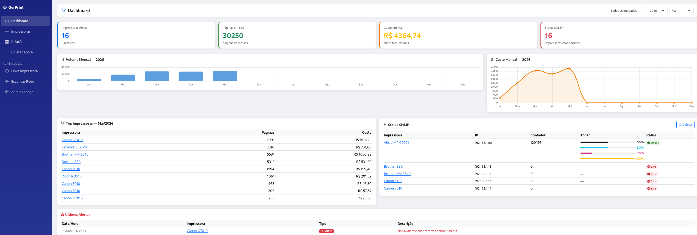
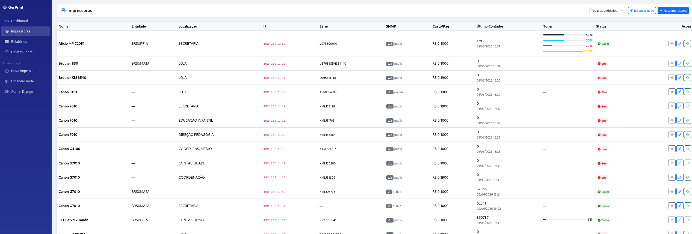
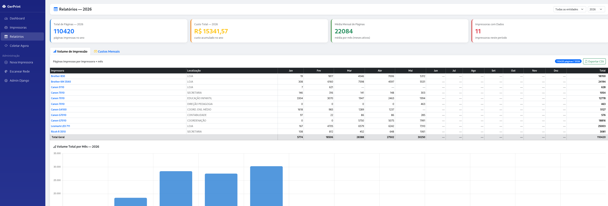
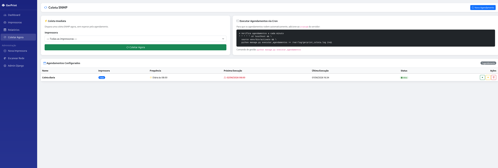
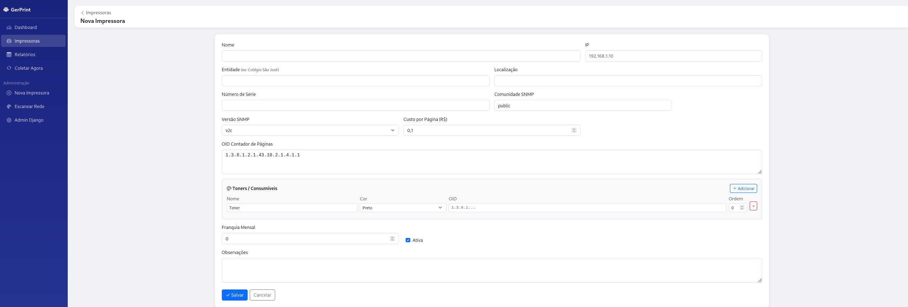

# GerPrint — Printer Management System

[](https://www.gnu.org/licenses/gpl-3.0)
[](https://www.python.org/)
[](https://www.djangoproject.com/)
[](../../actions/workflows/ci.yml)

**GerPrint** is an open-source web system for monitoring network printers via SNMP. Track page counters, calculate costs per department, generate monthly reports, and schedule automatic data collection — all without installing any agent on the printers.



> 🇧🇷 [Documentação em Português](README.md)

---

## ✨ Features

- **📊 Dashboard** with monthly KPIs, volume charts and printer ranking
- **🖨️ SNMP Monitoring** — reads page counters automatically (v1, v2c)
- **🔍 Network Scan** — discovers printers on the subnet with one click
- **💰 Monthly Reports** with pages and cost pivot table, CSV export
- **📅 Scheduled Collection** — by fixed time or interval
- **🎨 Multi-OID per printer** — sums PC-print and copy counters for true total
- **🔧 SNMP Diagnostic** — identifies the correct OID for any model
- **🏷️ Multi-entity** — groups printers by branch, department or contract

---

## 🚀 Quick Start

```bash
git clone https://github.com/adersonslv/gerprint.git
cd gerprint
docker compose up -d
```

Open **http://localhost:8000** · Admin: `admin` / `admin123`

> **SNMP note:** printers must be reachable from the container.
> If they don't respond, uncomment `network_mode: host` in `docker-compose.yml` (Linux only).

---

## 🖼️ Screenshots

<table>
  <tr>
    <td align="center">
      
      <br/><sub>Printer list</sub>
    </td>
    <td align="center">
      
      <br/><sub>Monthly pivot report</sub>
    </td>
  </tr>
  <tr>
    <td align="center">
      
      <br/><sub>SNMP collection & scheduling</sub>
    </td>
    <td align="center">
      
      <br/><sub>Printer registration</sub>
    </td>
  </tr>
</table>

---

## 🛠️ Manual Installation

```bash
git clone https://github.com/adersonslv/gerprint.git
cd gerprint

python3 -m venv venv
source venv/bin/activate        # Windows: venv\Scripts\activate

pip install -r requirements.txt
python manage.py migrate
python manage.py createsuperuser
python manage.py runserver
```

---

## 🖨️ Tested Printers

| Brand | Model | Counter OID | Notes |
|---|---|---|---|
| Canon | G7010 / G4100 | `1.3.6.1.2.1.43.10.2.1.4.1.1` | Inkjet MFP |
| Canon | imageRUNNER 5110 / GX7010 | `1.3.6.1.2.1.43.10.2.1.4.1.1` | Laser MFP |
| Brother | MFC-830 / KM-3540 | `1.3.6.1.2.1.43.10.2.1.4.1.1` | |
| Ricoh | MP 3510 | `1.3.6.1.4.1.367.3.2.1.2.1.1.0` | Proprietary OID |
| Lexmark | LEX 711 | `1.3.6.1.2.1.43.10.2.1.4.1.1` | |

Full OID database: [`doc/oids_testados.md`](doc/oids_testados.md)

> Tested on a model not listed? Open an [issue](../../issues/new?template=novo_modelo.yml)!

---

## ⚙️ Environment Variables

| Variable | Default | Description |
|---|---|---|
| `SECRET_KEY` | insecure (dev) | Django secret key — **change in production** |
| `DEBUG` | `True` | Set `False` in production |
| `ALLOWED_HOSTS` | `*` | Comma-separated allowed hosts |
| `DJANGO_SUPERUSER_USERNAME` | — | Auto-creates admin on first run |
| `DJANGO_SUPERUSER_PASSWORD` | — | Admin initial password |
| `PORT` | `8000` | Server port |

---

## 🤝 Contributing

Contributions are welcome! See [CONTRIBUTING.md](CONTRIBUTING.md) for details.

- 🐛 **Bugs** → [Bug report](../../issues/new?template=bug_report.yml)
- 💡 **Ideas** → [Feature request](../../issues/new?template=feature_request.yml)
- 🖨️ **New printer model** → [Submit OIDs](../../issues/new?template=novo_modelo.yml)
- 💬 **Questions** → [Discussions](../../discussions)

---

## 📄 License

Copyright © 2025 [Aderson Silva](mailto:aderson.slv@gmail.com) — [GPL v3](LICENSE)

<sub>Developed with the assistance of <a href="https://www.anthropic.com">Claude AI</a> (Anthropic)</sub>
