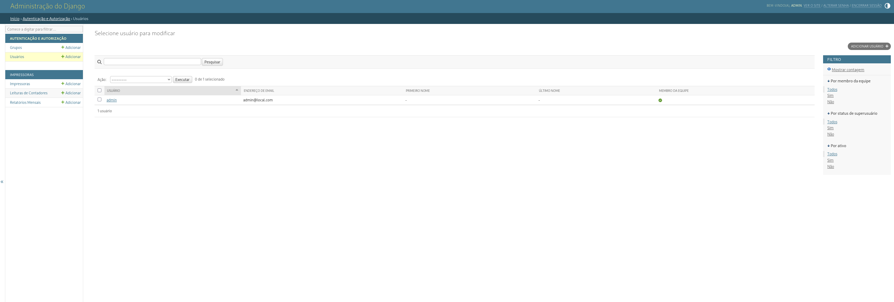

# GerPrint — Sistema de Gestão de Impressoras

[](https://www.gnu.org/licenses/gpl-3.0)
[](https://www.python.org/)
[](https://www.djangoproject.com/)
[](../../actions/workflows/ci.yml)
[](https://www.anthropic.com)

> 🇬🇧 [English version](README.en.md)

Sistema web **open source** para monitorar impressoras de rede via SNMP. Acompanhe contadores de páginas, calcule custos por setor, gere relatórios mensais e agende coletas automáticas — tudo em uma interface limpa, sem agente instalado nas impressoras.


---

## ✨ Funcionalidades

- **📊 Dashboard** com KPIs, gráficos de volume e ranking por impressora
- **🖨️ Monitoramento SNMP** — lê contadores automaticamente (v1, v2c)
- **🔍 Escaneamento de rede** — detecta impressoras na sub-rede com um clique
- **💰 Relatórios mensais** de páginas e custos com exportação CSV/Excel
- **📅 Agendamentos** — coleta automática por horário fixo ou intervalo
- **🎨 Múltiplos OIDs por impressora** — soma contadores de impressão e cópia
- **🔧 Diagnóstico SNMP** — identifica o OID correto para cada modelo
- **🏷️ Multi-entidade** — agrupa impressoras por filial, setor ou contrato

---

## 🚀 Quick Start com Docker

```bash
git clone https://github.com/adersonslv/gerprint.git
cd gerprint
docker compose up -d
```

Acesse **http://localhost:8000** · Admin: `admin` / `admin123`

> **Nota sobre SNMP:** as impressoras precisam estar acessíveis a partir do container.
> Se elas não responderem, descomente `network_mode: host` no `docker-compose.yml`
> (funciona em Linux; no Windows/Mac use a rede bridge com rotas configuradas).

---

## 🖼️ Screenshots

<table>
  <tr>
    <td align="center">
      
      <br/><sub>Lista de impressoras</sub>
    </td>
    <td align="center">
      
      <br/><sub>Relatório mensal pivot</sub>
    </td>
  </tr>
  <tr>
    <td align="center">
      
      <br/><sub>Coleta SNMP e agendamentos</sub>
    </td>
    <td align="center">
      
      <br/><sub>Cadastro de impressora</sub>
    </td>
  </tr>
  <tr>
    <td align="center" colspan="2">
      
      <br/><sub>Painel administrativo Django</sub>
    </td>
  </tr>
</table>

---

## 🛠️ Instalação manual

```bash
# 1. Clone o repositório
git clone https://github.com/adersonslv/gerprint.git
cd gerprint

# 2. Crie e ative o ambiente virtual
python3 -m venv venv
source venv/bin/activate   # Windows: venv\Scripts\activate

# 3. Instale as dependências
pip install -r requirements.txt

# 4. Execute as migrações
python manage.py migrate

# 5. Crie o superusuário
python manage.py createsuperuser

# 6. Inicie o servidor
python manage.py runserver
```

Acesse **http://127.0.0.1:8000**

---

## 🖨️ Impressoras testadas

| Fabricante | Modelo | OID padrão | Observações |
|---|---|---|---|
| Canon | G7010 / G4100 | `1.3.6.1.2.1.43.10.2.1.4.1.1` | Multifuncional inkjet |
| Canon | imageRUNNER 5110 / 7010 | `1.3.6.1.2.1.43.10.2.1.4.1.1` | Laser multifuncional |
| Brother | MFC-830 / KM-3540 | `1.3.6.1.2.1.43.10.2.1.4.1.1` | |
| Ricoh | MP 3510 | `1.3.6.1.4.1.367.3.2.1.2.1.1.0` | OID proprietário |
| Lexmark | LEX 711 | `1.3.6.1.2.1.43.10.2.1.4.1.1` | |

> Testou em um modelo não listado? Abra uma [issue](../../issues/new?template=novo_modelo.yml) ou consulte o banco completo em [`doc/oids_testados.md`](doc/oids_testados.md).

---

## ⚙️ Variáveis de ambiente (Docker / produção)

| Variável | Padrão | Descrição |
|---|---|---|
| `SECRET_KEY` | insegura (dev) | Chave Django — **troque em produção** |
| `DEBUG` | `True` | `False` em produção |
| `ALLOWED_HOSTS` | `*` | Hosts permitidos, separados por vírgula |
| `DJANGO_SUPERUSER_USERNAME` | — | Cria admin automaticamente na primeira inicialização |
| `DJANGO_SUPERUSER_PASSWORD` | — | Senha do admin inicial |
| `DJANGO_SUPERUSER_EMAIL` | — | E-mail do admin inicial |
| `PORT` | `8000` | Porta do servidor |

---

## 📁 Documentação completa

Consulte [`doc/README.md`](doc/README.md) para documentação técnica detalhada: modelos de dados, rotas da API, comandos de gerenciamento, configuração de cron e orientações de produção.

---

## 🤝 Contribuindo

Contribuições são muito bem-vindas! Veja como ajudar:

- 🐛 **Bugs** → Abra uma [issue](../../issues) com passos para reproduzir
- 💡 **Sugestões** → Use as [Discussions](../../discussions)
- 🖨️ **Novo modelo testado** → Envie um PR adicionando à tabela acima
- 🌐 **Tradução** → Ajude a traduzir a interface para outros idiomas
- 🔧 **Código** → Veja as issues marcadas com `good first issue`

> Antes de abrir um PR, leia o [`CONTRIBUTING.md`](CONTRIBUTING.md) *(em breve)*.

---

## 📄 Licença

Copyright © 2025 [Aderson Silva](mailto:aderson.slv@gmail.com)

Distribuído sob a **GNU General Public License v3.0** — veja [`LICENSE`](LICENSE) e [`doc/LICENCA.md`](doc/LICENCA.md).

---

<sub>Desenvolvido com o auxílio do <a href="https://www.anthropic.com">Claude AI</a> (Anthropic)</sub>
